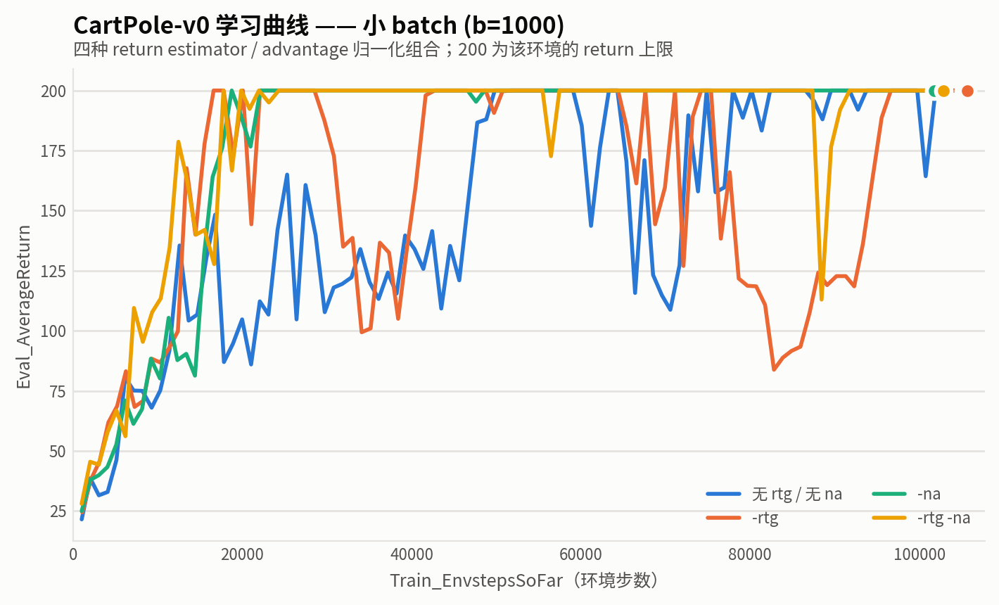
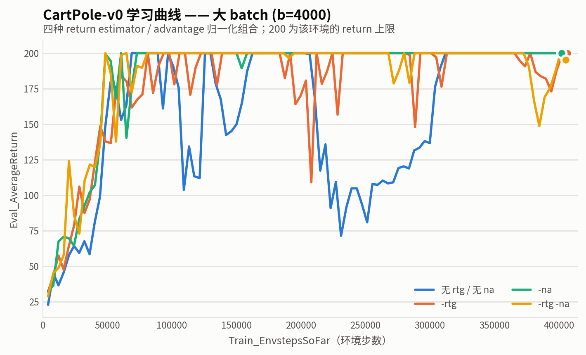
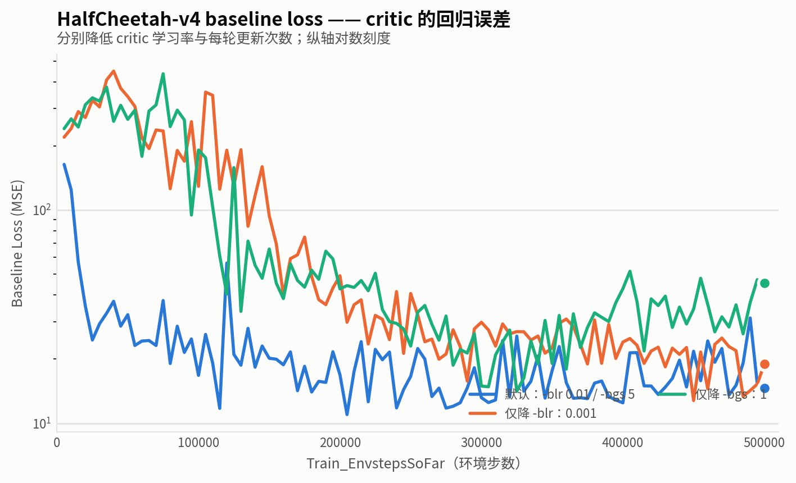
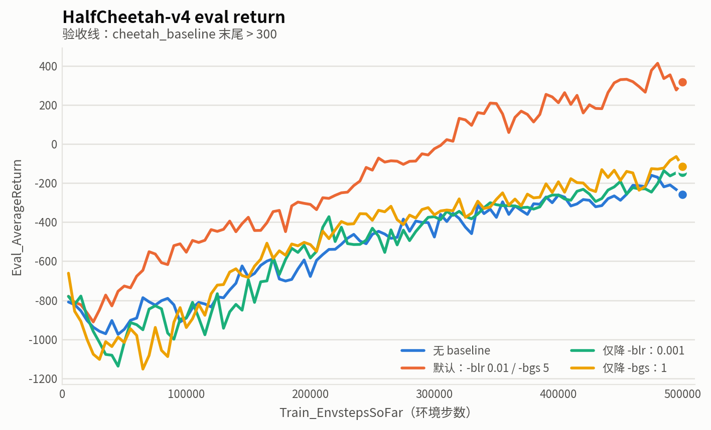
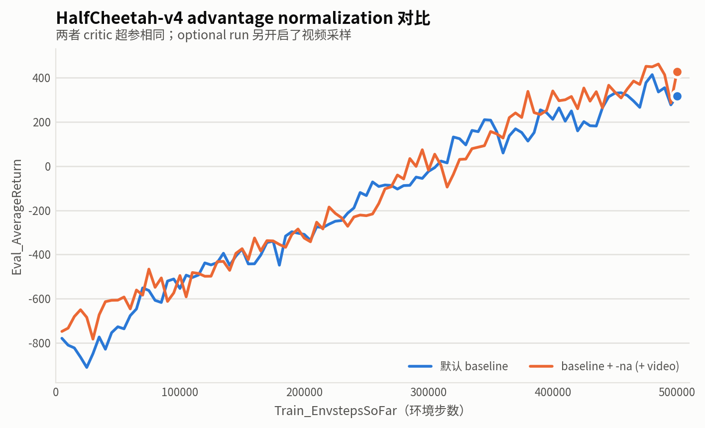
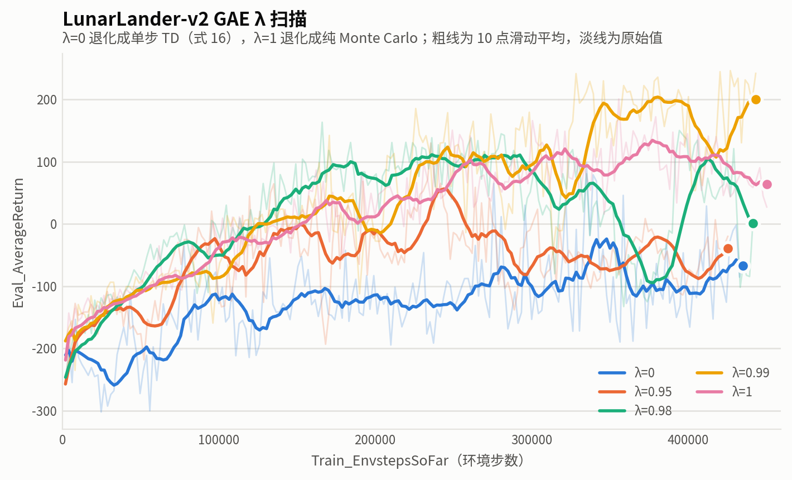

# HW2 报告：Policy Gradients

> **交付去向**
> - 本文件导出 PDF → Gradescope 的 **HW2 Report**
> - 代码 + `exp/` 日志 → **HW2 Code**（submit.zip，<100MB）
> - 图片放 `hw2/report/`，命名见各节
>
> **填写方式**：每节的命令表跑完一行就填一行。命令不用手抄，
> 每个 run 的 `exp/<run目录>/flags.json` 里有完整参数，直接复制。
>
> **导出 PDF**（在 `hw2/` 目录下执行，图片用的是相对路径，必须从这里跑）：
>
> ```bash
> pandoc REPORT.md -o REPORT.pdf --pdf-engine=xelatex \
>   -V mainfont="DejaVu Sans" -V monofont="DejaVu Sans Mono" \
>   -V CJKmainfont="Noto Sans CJK SC" \
>   -V geometry:margin=2cm -V colorlinks=true
> ```
>
> 三个字体缺一不可：`CJKmainfont` 管中文，`mainfont` 管表格里的 ✓/✗，
> `monofont` 管代码块里的希腊字母（γ ε μ π σ）。少一个对应字符就会**静默变成空白**，
> 导出后务必翻一遍 PDF。上面这组已验证零缺字。

---

## 实验 1 — CartPole-v0（PDF §3.2）

### 1.1 运行记录

全部 8 个 run 均为 `seed=1`，run 目录形如 `CartPole-v0_<exp_name>_sd1_20260820_1409xx`。

| exp_name | -b | -rtg | -na | 最终 Eval | 末 10 次均值 | 收敛到 200 | 首达 200 的环境步数 | 达 200 后跌破 150 的次数 |
|---|---|---|---|---|---|---|---|---|
| `cartpole`          | 1000 | ✗ | ✗ | 200.00 | 196.43 | ✓ | 49,822 | 6 |
| `cartpole_rtg`      | 1000 | ✓ | ✗ | 200.00 | 200.00 | ✓ | **16,601** | 27 |
| `cartpole_na`       | 1000 | ✗ | ✓ | 200.00 | 200.00 | ✓ | 18,743 | **0** |
| `cartpole_rtg_na`   | 1000 | ✓ | ✓ | 200.00 | 200.00 | ✓ | 17,762 | 1 |
| `cartpole_lb`       | 4000 | ✗ | ✗ | 200.00 | 200.00 | ✓ | 68,888 | 28 |
| `cartpole_lb_rtg`   | 4000 | ✓ | ✗ | 200.00 | 189.67 | ✓ | 81,316 | 2 |
| `cartpole_lb_na`    | 4000 | ✗ | ✓ | 200.00 | 200.00 | ✓ | 60,669 | 1 |
| `cartpole_lb_rtg_na`| 4000 | ✓ | ✓ | 195.33 | 183.17 | ~ | 48,489 | 2 |

「收敛到 200」判据：末 10 次迭代均值 ≥ 195。`cartpole_lb_rtg_na` 末尾恰好赶上一次回落（末次 195.33），
曲线上此前长期贴顶，记作 `~`。

**验收线满足**：小 batch 的最佳（`cartpole_na`）与大 batch 的最佳（`cartpole_lb_na`）都稳定在 200。

> 后两列不是 PDF 要求的，是为了回答 §1.3 加的 —— 单看「最终 Eval」八组几乎全是 200，
> 区分不出好坏；真正的差异在**多快到达**和**到达后稳不稳**。

**验收线**：小 batch 四组里的最佳、大 batch 四组里的最佳，**各自**都要收敛到 200
（PDF §3.2 原文 "in both large and small batch cases"）。某一边到不了就回去查实现。

### 1.2 图

x 轴一律用 `Train_EnvstepsSoFar`，**不是**迭代数。

**小 batch (b=1000)** —— 前缀 `cartpole` 且不含 `lb` 的四组：



**大 batch (b=4000)** —— 前缀 `cartpole_lb` 的四组：



> 两张图的横轴量级不同（约 10 万 vs 约 40 万步），因为大 batch 每次迭代消耗 4 倍环境步数。
> 这正是 PDF 要求横轴用 `Train_EnvstepsSoFar` 而非迭代数的意义 —— 见 §1.3 Q4。

### 1.3 问题

**Q1. 不做 advantage normalization 时，trajectory-centric 和 reward-to-go 哪个表现更好？**

**reward-to-go 更好**，但两个 batch size 下的优势体现在不同方面。

小 batch（`cartpole` vs `cartpole_rtg`）：reward-to-go 在 **16,601** 步首次达到 200，
trajectory-centric 要 **49,822** 步，快约 3 倍。图 1 里蓝线（trajectory-centric）在 100–140
的区间长时间徘徊，橙线（reward-to-go）在 2 万步左右就冲顶。

大 batch（`cartpole_lb` vs `cartpole_lb_rtg`）：首次达标反而是 trajectory-centric 略快
（68,888 vs 81,316），但稳定性差距很大 —— trajectory-centric 达标后跌破 150 达 **28 次**，
最低掉到 71.33，图 2 里蓝线在 20–30 万步之间有一段持续约 10 万步的塌陷；
reward-to-go 只有 2 次，最低 109。

综合：reward-to-go 要么更快（小 batch），要么明显更稳（大 batch），没有一个 batch size 下它是更差的。

> 注意：本作业只跑了 `seed=1` 一个种子，CartPole 的单次运行方差极大
>（同一份代码同一个种子，在 GPU 上跑出的 `cartpole` 末值只有 62.71，CPU 上是 200）。
> 上面「大 batch 下 trajectory-centric 首次达标更快」这类单点名次不宜当作结论，
> 可靠的信号是**跨四组一致出现**的趋势。

---

**Q2. 两种 value estimator，为什么其中一个通常更受偏好？**

**因为 reward-to-go 方差更低，且这个方差是白白省下来的 —— 不引入任何偏差。**

PDF §2.2.1 的 causality 论证：时刻 $t$ 的动作不可能影响 $t$ 之前已经发生的奖励。
trajectory-centric 的权重是整条轨迹的回报 $\sum_{t'=0}^{H-1}\gamma^{t'}r_{t'}$，
里面 $t'<t$ 的那部分与 $a_t$ 统计独立，其贡献的期望为零 —— 但**方差不为零**。
去掉它，梯度估计的期望不变，方差变小。

从信用分配的角度更直观：trajectory-centric 给轨迹里**每一个**动作**同一个**权重 $R(\tau)$。
代码里这件事是显式的 —— `_discounted_return` 返回的是 `np.full(T, total)`，
同一个标量复制 T 份。于是一条整体不错的轨迹里那个糟糕的动作也会被正向强化，
反之亦然；只有靠大量采样让这些噪声互相抵消。reward-to-go 让每个动作只承担
它**可能影响到**的那部分奖励，信用分配准确得多。

严格地说，被删掉的那一项 $X_t=\nabla_\theta\log\pi_\theta(a_t\mid s_t)\cdot\sum_{t'<t}\gamma^{t'}r_{t'}$
期望恒为零：$\sum_{t'<t}$ 那部分与 $a_t$ 无关、可以提到期望外，而

$$\mathbb{E}_{a\sim\pi_\theta}\big[\nabla_\theta\log\pi_\theta(a\mid s)\big]=\sum_a\nabla_\theta\pi_\theta(a\mid s)=\nabla_\theta\sum_a\pi_\theta(a\mid s)=\nabla_\theta 1=0$$

（score function 恒等式，本质是概率归一化求导）。但它的**方差**不为零：

$$\operatorname{Var}(X_t)=\mathbb{E}[X_t^2]-\underbrace{(\mathbb{E}[X_t])^2}_{=\,0}>0$$

在 CartPole 上（$\gamma=1$、每步 $r=1$）有 $P_t=t$、$F_t=200-t$，
到轨迹末尾 $t=199$ 时噪信比接近 $199:1$。

所以删掉它是纯赚：估计量的期望一分不变（仍然无偏），方差直接砍掉一块。
本仓库 `NOTES.md` 阶段 1 有完整推导和数值验证（500 个 batch 的逐坐标 $t$ 检验：
该项 $\max|t|=1.25$ 测不出非零，而信号项 $\max|t|=48.72$；
单 batch 梯度标准差 trajectory-centric 是 reward-to-go 的 2.34 倍）。
这就是 PDF §2.2.2 说 "we almost always use the second formulation" 的原因。

---

**Q3. Advantage normalization 有帮助吗？**

**有，而且是这次实验里影响最大的单个开关 —— 但它改善的是稳定性，不是收敛速度。**

四组对照里有三组的改善是压倒性的（「达 200 后跌破 150 的次数」）：

| 对照 | 无 `-na` | 有 `-na` |
|---|---|---|
| 小 batch，无 rtg | 6 次（最低 108.75） | **0 次**（最低 176.67） |
| 小 batch，有 rtg | 27 次（最低 83.80） | **1 次**（最低 113.00） |
| 大 batch，无 rtg | 28 次（最低 71.33） | **1 次**（最低 140.33） |
| 大 batch，有 rtg | 2 次 | 2 次（无变化） |

速度上则基本没差别（小 batch：18,743 / 17,762 vs 16,601），甚至略慢于纯 `-rtg`。

机制：CartPole 的 return 在训练中从约 20 涨到 200，**advantage 的数量级也跟着涨了 10 倍**。
loss 是 `-(log_prob * advantages).mean()`，advantage 变大等价于**有效学习率变大 10 倍** ——
这正是崩塌总是发生在训练中后期（策略已经变好之后）而不是开头的原因。
$(A-\mu)/(\sigma+\varepsilon)$ 把 advantage 的尺度钉死在均值 0、标准差 1，有效学习率不再随性能漂移。

这也解释了 PDF §4.2 那句「advantage normalization is a very powerful trick, and eliminates
the need for a baseline on most of the simple environments」—— `-na` 减掉的 batch 均值 $\mu$
本身就起到了一个（有偏的）常数基线的作用。

---

**Q4. Batch size 有影响吗？**

**有，但方向和直觉相反：按环境步数算，大 batch 更费样本。**

这正是 PDF 要求 x 轴用 `Train_EnvstepsSoFar` 而不是迭代数的原因 —— 按迭代数看大 batch 显然更快，
但那是拿 4 倍的数据换来的。首次达到 200 所需的环境步数：

| | 小 batch (1000) | 大 batch (4000) |
|---|---|---|
| 无 rtg 无 na | 49,822 | 68,888 |
| `-rtg` | 16,601 | 81,316 |
| `-na` | 18,743 | 60,669 |
| `-rtg -na` | 17,762 | 48,489 |

四组全部是小 batch 更省样本，`-rtg` 那组差了近 5 倍。

大 batch 确实降低了单次梯度估计的方差（`-rtg` 组的崩塌次数从 27 降到 2），
但这个稳定化作用**不是普适的** —— `cartpole_lb`（无 rtg 无 na）反而出现了全部八组里
最深、最长的一次塌陷（最低 71.33，持续约 10 万步）。

结论：在 CartPole 这种简单环境里，**batch size 不是万能药，`-na` 的性价比高得多**。
小 batch + `-na` 用不到 2 万步就稳定到 200；大 batch 花 4–8 万步才到，稳定性还不一定更好。
（当然，更复杂的环境里梯度噪声更大，大 batch 的价值会显著上升 —— 实验 2 的 HalfCheetah
用的就是 `-b 5000`。）

### 1.4 完整命令

统一由 `run_experiments.sh exp1` 运行（`--no_gpu`：实测 GPU 比 CPU 慢 1.7 倍）。
其余参数全部为默认值，见各 run 的 `flags.json`。

```bash
uv run src/scripts/run.py --env_name CartPole-v0 --no_gpu -n 100 -b 1000               --exp_name cartpole
uv run src/scripts/run.py --env_name CartPole-v0 --no_gpu -n 100 -b 1000 -rtg          --exp_name cartpole_rtg
uv run src/scripts/run.py --env_name CartPole-v0 --no_gpu -n 100 -b 1000      -na      --exp_name cartpole_na
uv run src/scripts/run.py --env_name CartPole-v0 --no_gpu -n 100 -b 1000 -rtg -na      --exp_name cartpole_rtg_na
uv run src/scripts/run.py --env_name CartPole-v0 --no_gpu -n 100 -b 4000               --exp_name cartpole_lb
uv run src/scripts/run.py --env_name CartPole-v0 --no_gpu -n 100 -b 4000 -rtg          --exp_name cartpole_lb_rtg
uv run src/scripts/run.py --env_name CartPole-v0 --no_gpu -n 100 -b 4000      -na      --exp_name cartpole_lb_na
uv run src/scripts/run.py --env_name CartPole-v0 --no_gpu -n 100 -b 4000 -rtg -na      --exp_name cartpole_lb_rtg_na
```

---

## 实验 2 — HalfCheetah-v4 baseline（PDF §4.2）

### 2.1 运行记录

| exp_name | use_baseline | -blr | -bgs | -na | video freq | 最终 Eval_AverageReturn | run 目录 |
|---|---|---|---|---|---|---|---|
| `cheetah` | ✗ | — | — | ✗ | -1 | -257.57 | `HalfCheetah-v4_cheetah_sd1_20260821_135111` |
| `cheetah_baseline` | ✓ | 0.01 | 5 | ✗ | -1 | **316.90** | `HalfCheetah-v4_cheetah_baseline_sd1_20260821_135111` |
| `cheetah_baseline_blr0.001` | ✓ | **0.001** | 5 | ✗ | -1 | -146.19 | `HalfCheetah-v4_cheetah_baseline_blr0.001_sd1_20260821_135111` |
| `cheetah_baseline_bgs1` | ✓ | 0.01 | **1** | ✗ | -1 | -113.96 | `HalfCheetah-v4_cheetah_baseline_bgs1_sd1_20260821_135111` |
| `cheetah_baseline_na_video` | ✓ | 0.01 | 5 | ✓ | 10 | **428.03** | `HalfCheetah-v4_cheetah_baseline_na_video_sd1_20260821_135111` |

**验收线**：`cheetah_baseline` 末尾 Eval return 要 > 300。跑 2–3 次还到不了就回去查实现。

### 2.2 图



图中的 baseline loss 是 critic 在当前 batch 上完成指定次数更新后的 MSE。默认配置
(`-blr 0.01 -bgs 5`) 最快降到较低误差区间；只更新一次的 `-bgs 1` 在训练后期仍有明显更高的
回归误差。`-blr 0.001` 的早期下降更慢，虽然后期 loss 追上了默认配置，但已经错过了早期为 actor
提供准确 advantage 的时机。



默认 baseline 的 eval return 在约 320K 环境步后超过 0，并最终达到 **316.90**；其余三条主实验曲线
在训练结束时仍为负回报。这说明不仅需要 value baseline，critic 还必须以足够快的速度跟踪当前 policy 的
value target。



第三张图将 critic 超参完全相同的默认 baseline 与 `baseline + -na` 直接对比。加入 advantage normalization
的 optional run 最终从 **316.90** 提高到 **428.03**，且末 10 轮平均 return 为 **390.00**，高于默认 baseline
的 **328.64**。不过 optional run 还开启了视频轨迹采样，因此该图用于展示表现差异，不将全部增益严格归因于 `-na`。

### 2.3 问题

**Q. 分别降低 `-bgs` 和 `-blr` 后，(a) baseline 学习曲线怎么变？(b) 策略性能怎么变？**

#### Reward-to-go 与 value baseline

所有主实验都已使用 reward-to-go：

$$
\hat Q_t^{\mathrm{RTG}}=\sum_{t'=t}^{T}\gamma^{t'-t}r_{t'}
$$

它去掉了动作之前的奖励，改善了时间上的 credit assignment，但后续轨迹的随机性仍会使
$\hat Q_t$ 有较高方差。本实验的 baseline 就是学习得到的 state-value function：

$$
V_\phi(s_t)\approx\mathbb E_\pi[\hat Q_t^{\mathrm{RTG}}\mid s_t],
\qquad
\hat A_t=\hat Q_t^{\mathrm{RTG}}-V_\phi(s_t)
$$

Actor 使用 $\hat A_t$ 而不是原始 $\hat Q_t$ 作为 $\log\pi_\theta(a_t\mid s_t)$ 的权重。这会减去“当前状态本身容易或困难”
带来的回报波动，使更新主要取决于当前动作是否优于该状态下的平均水平。因为 baseline 不依赖当前动作，
理论上它不改变 policy-gradient 的期望方向，却能降低有限样本下的估计方差。

在 actor learning rate `0.01` 和 discount factor $\gamma=0.95$ 都不变时，只用 reward-to-go 的最终
`Eval_AverageReturn` 为 **-257.57**，加入默认 value baseline 后提高到 **316.90**。因此 reward-to-go
并未完全解决高方差问题，状态相关的 value baseline 对 HalfCheetah 的稳定学习至关重要。

#### 降低 baseline learning rate：`0.01 → 0.001`

| 配置 | 初始 Baseline Loss | 最终 Baseline Loss | 末 10 轮 loss 均值 | 最终 Eval return |
|---|---:|---:|---:|---:|
| 默认 `blr=0.01, bgs=5` | 163.88 | 14.59 | 19.07 | **316.90** |
| `blr=0.001, bgs=5` | 219.84 | 18.93 | 19.12 | -146.19 |
| `blr=0.01, bgs=1` | 241.12 | 45.41 | 36.23 | -113.96 |

将 `-blr` 降低十倍后，critic 在早期对当前 reward-to-go target 的拟合明显更慢，策略最终只达到
**-146.19**。它的末期 loss 已接近默认配置，所以不应简单说“critic 始终没有收敛”。更准确的解释是：
policy 在不断改变，value target 也是非平稳的；较小的 critic learning rate 使 value function 早期跟踪太慢，
向 actor 提供了质量较差的 advantage estimates。即使 critic 后期误差追上，actor 在早期走入的训练轨迹也不会自动恢复。

#### 降低 baseline gradient steps：`5 → 1`

将 `-bgs` 从 5 降到 1 后，critic 每个 batch 只进行一次回归更新。其末 10 轮 baseline loss 均值从 **19.07**
上升到 **36.23**，最终 loss 达到 **45.41**，显示 critic 对当前 target 有明显的 underfitting。因此
$\hat A_t=\hat Q_t-V_\phi(s_t)$ 中的 $V_\phi$ 不够准确，降方差效果变差，最终 eval return 只有 **-113.96**。

#### Advantage normalization

Optional run 进一步对 advantage 做 batch normalization：

$$
\tilde A_t=\frac{\hat A_t-\mu_A}{\sigma_A+\epsilon}
$$

它同时居中 advantage 并统一不同 batch 的梯度尺度，本次 `cheetah_baseline_na_video` 获得了最高的最终
return **428.03**。这说明 advantage normalization 在本任务中非常有效，但该 run 还同时开启了视频轨迹采样，
会改变随机数消耗和后续训练数据；因此它是 optional enhanced run，不能将相对默认 baseline 的全部提升严格归因于 `-na`。

### 2.4 完整命令

```bash
uv run src/scripts/run.py --no_gpu --env_name HalfCheetah-v4 -n 100 -b 5000 -eb 3000 -rtg --discount 0.95 -lr 0.01 --exp_name cheetah
uv run src/scripts/run.py --no_gpu --env_name HalfCheetah-v4 -n 100 -b 5000 -eb 3000 -rtg --discount 0.95 -lr 0.01 --use_baseline -blr 0.01 -bgs 5 --exp_name cheetah_baseline
uv run src/scripts/run.py --no_gpu --env_name HalfCheetah-v4 -n 100 -b 5000 -eb 3000 -rtg --discount 0.95 -lr 0.01 --use_baseline -blr 0.001 -bgs 5 --exp_name cheetah_baseline_blr0.001
uv run src/scripts/run.py --no_gpu --env_name HalfCheetah-v4 -n 100 -b 5000 -eb 3000 -rtg --discount 0.95 -lr 0.01 --use_baseline -blr 0.01 -bgs 1 --exp_name cheetah_baseline_bgs1
uv run src/scripts/run.py --no_gpu --env_name HalfCheetah-v4 -n 100 -b 5000 -eb 3000 -rtg --discount 0.95 -lr 0.01 --use_baseline -blr 0.01 -bgs 5 -na --video_log_freq 10 --exp_name cheetah_baseline_na_video
```

### 2.5 可选

- [x] 在同一个 optional run 中加回 `-na` 并设置 `--video_log_freq 10`

---

## 实验 3 — LunarLander-v2 GAE（PDF §5）

其余超参一律不许动，只扫 λ。

### 3.1 运行记录

| λ | 训练中出现过的最高 Eval_AverageReturn | 最终 Eval_AverageReturn | run 目录 |
|---|---|---|---|
| 0    | | | |
| 0.95 | | | |
| 0.98 | | | |
| 0.99 | | | |
| 1    | | | |

**验收线**：最好的那次训练过程中至少出现一次 > 150。

### 3.2 图

五条 λ 曲线画在同一张：



### 3.3 问题

**Q1. λ 如何影响任务表现？**

> TODO

**Q2. λ=0 对应什么？λ=1 对应什么？结合 LunarLander 的结果用一两句话说明。**

> TODO（提示：把 λ 代进 PDF 式 (21) 的递推里，看退化成什么 —— 一个是式 (16) 的单步 TD，一个是纯 Monte Carlo）

### 3.4 完整命令

```bash
# TODO
```

---

## 实验 4 — InvertedPendulum-v4 调参（PDF §6）

目标：**100K 环境步以内**摸到 return 1000。基线设置要 500K 步（`-n 100 -b 5000`）。

### 4.1 调参过程

> 这张表是 Q2 的原始素材 —— `flags.json` 只存了「每组是什么」，不存「你为什么这么改」。
> 每跑一组就补一行，**"改动理由" 这列不要留空**。

| # | 相对上一组改了什么 | 改动理由 | 首次到 1000 的步数 | 观察 |
|---|---|---|---|---|
| 0 | （默认基线） | — | | |
| 1 | | | | |
| 2 | | | | |
| 3 | | | | |

### 4.2 最佳配置

```bash
# TODO: exp_name 必须以 pendulum 开头
```

| 超参 | 默认 | 我的值 |
|---|---|---|
| `--discount` | 1.0 | |
| `-n` / `-b` | 100 / 5000 | |
| `-lr` | 5e-3 | |
| `-l` / `-s` | 2 / 64 | |
| `-rtg` | ✗ | |
| `-na` | ✗ | |
| `--use_baseline` | ✗ | |
| `--gae_lambda` | None | |

### 4.3 问题

**Q. 哪些超参在调参过程中真正起了作用？**

> TODO（直接从 4.1 的表里读结论）

### 4.4 图

我的配置 vs 默认配置，x 轴环境步数：


> **这张图需要两个 run**：4.1 表里的第 0 行（默认基线，`-n 100 -b 5000` 不改任何参数）
> 和最佳配置那一行。默认那次跑完**不要删**，画图和提交都要用。

---

## 提交前检查（PDF §7）

`exp/` 下必须有这 15 个 run，目录名前缀要精确匹配：

- [ ] `CartPole-v0_cartpole_sd*`
- [ ] `CartPole-v0_cartpole_rtg_sd*`
- [ ] `CartPole-v0_cartpole_na_sd*`
- [ ] `CartPole-v0_cartpole_rtg_na_sd*`
- [ ] `CartPole-v0_cartpole_lb_sd*`
- [ ] `CartPole-v0_cartpole_lb_rtg_sd*`
- [ ] `CartPole-v0_cartpole_lb_na_sd*`
- [ ] `CartPole-v0_cartpole_lb_rtg_na_sd*`
- [x] `HalfCheetah-v4_cheetah_sd*`
- [x] `HalfCheetah-v4_cheetah_baseline_sd*`
- [x] `HalfCheetah-v4_cheetah_baseline_blr0.001_sd*` —— 只降 `-blr`
- [x] `HalfCheetah-v4_cheetah_baseline_bgs1_sd*` —— 只降 `-bgs`
      PDF §7 的目录树没列这两个额外消融，但 grader 按前缀匹配，多目录无害
- [ ] `LunarLander-v2_lunar_lander_lambda0_sd*`
- [ ] `LunarLander-v2_lunar_lander_lambda0.95_sd*`
- [ ] `LunarLander-v2_lunar_lander_lambda0.98_sd*`
- [ ] `LunarLander-v2_lunar_lander_lambda0.99_sd*`
- [ ] `LunarLander-v2_lunar_lander_lambda1_sd*`
- [ ] `InvertedPendulum-v4_pendulum*_sd*` —— **至少两个**：默认基线 + 最佳配置（§4.4 的图要用）。
      exp_name 必须以 `pendulum` 开头，PDF §7 说明 grader 只匹配到 `pendulum` 为止

其他：

- [ ] 每个 run 目录里有 `agent.pt` / `flags.json` / `log.csv` / `log.pkl`
- [ ] `src/` 目录结构与原始仓库一致
- [ ] 带上 `pyproject.toml` / `uv.lock` / `README.md`
- [ ] `exp` 和 `src` **平铺在 zip 根目录**，不要再套一层父目录
- [ ] submit.zip < 100MB
