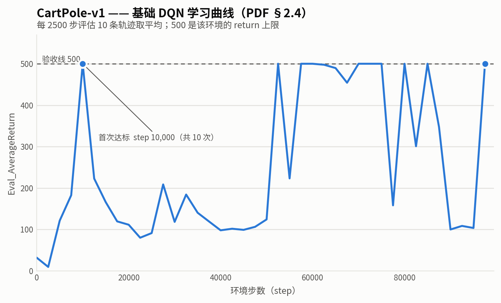
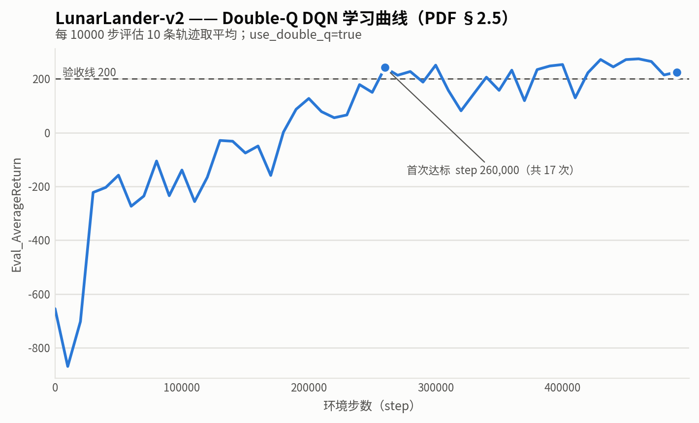
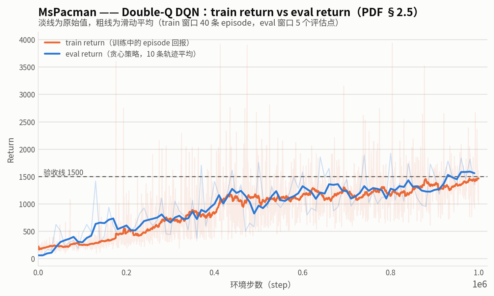

# HW3 报告：Q-Learning 与 Actor-Critic

> **交付去向**
> - 本文件导出 PDF → Gradescope 的 **HW3 Report**
> - 代码 + `exp/` 日志 → **HW3 Code**（submit.zip，<100MB）
> - 图片放 `hw3/report/`，由 `uv run plot_results.py <阶段>` 生成
>
> **填写方式**：每节的命令表跑完一行就填一行。命令不用手抄，
> 每个 run 的 `exp/<run目录>/flags.json` 里有完整参数，直接复制。
>
> **导出 PDF**（在 `hw3/` 目录下执行，图片用的是相对路径，必须从这里跑）：
>
> ```bash
> pandoc REPORT.md -o REPORT.pdf --pdf-engine=xelatex \
>   -V mainfont="DejaVu Sans" -V monofont="DejaVu Sans Mono" \
>   -V CJKmainfont="Noto Sans CJK SC" \
>   -V geometry:margin=2cm -V colorlinks=true
> ```
>
> 三个字体缺一不可（沿用 hw2 已验证的组合）：`CJKmainfont` 管中文，
> `mainfont` 管表格里的 ✓/✗，`monofont` 管代码块里的希腊字母（γ ε φ）。
> 少一个对应字符会**静默变成空白**，导出后务必翻一遍 PDF。

---

## 实验 1 — CartPole-v1 基础 DQN（PDF §2.4）

### 1.1 运行记录

| run 目录 | seed | 设备 | 总步数 | 评估点 | 达 500 次数 | 首次达标 |
|---|---|---|---|---|---|---|
| `CartPole-v1_dqn_sd1_20260825_151358` | 1 | CPU（`--no_gpu`） | 100,000 | 40 | **10** | step **10,000** |

配置 `experiments/dqn/cartpole.yaml`：`hidden_size=64`、`num_layers=2`、`lr=5e-4`、
`discount=0.99`、`target_update_period=1000`、`batch_size=128`、`learning_starts=1000`、
`use_double_q=false`。

### 1.2 图



**图未做平滑。** PDF 的验收判据是「训练中至少一次达到 500」——这是尖峰事件不是趋势，
滑动平均会把峰削掉，让图读起来像没达标。40 个评估点也足够稀疏，直接画原始值即可。

曲线中段（15,000–50,000）回落到 80~200 是 DQN 的常态，不是实现问题：ε 那时还在 0.4 以上、
replay buffer 里旧策略的数据占比高、target 网络每 1000 步才同步一次。
ε 衰减到 0.1 附近（step 30,000 之后）曲线才稳定在高位。

### 1.3 完整命令

```bash
uv run src/scripts/run_dqn.py -cfg experiments/dqn/cartpole.yaml --eval_interval 2500 --no_gpu
```

> `--no_gpu` 不是笔误：CartPole 的 critic 只有 4,610 个参数，实测 CPU **1038 it/s** vs
> GPU **871 it/s**（20,000 步基准），CPU 快 19%。瓶颈在 `env.step()` 和逐步 `get_action`
> 的 host→device 拷贝，不在矩阵乘法。LunarLander 网络大 15 倍后这个结论会翻转，见 §2.3。

---

## 实验 2 — LunarLander-v2 Double-Q（PDF §2.5）

### 2.1 运行记录

| run 目录 | seed | 设备 | 总步数 | 评估点 | 达 200 次数 | 首次达标 | 最好 |
|---|---|---|---|---|---|---|---|
| `LunarLander-v2_dqn_sd1_20260825_153744` | 1 | GPU (RTX 4090) | 500,000 | 50 | **17** | step **260,000** | **274.0** |

配置 `experiments/dqn/lunarlander.yaml`：`hidden_size=256`、`num_layers=2`、`lr=1e-3`、
`discount=0.99`、`target_update_period=1000`、`batch_size=64`、`learning_starts=20000`、
**`use_double_q=true`**。最终评估点 224.7。

达标不是单点偶然：step 260,000 首次越线后，300,000 之后的 20 个评估点里有 14 个 ≥200。

### 2.2 图



### 2.3 完整命令

```bash
uv run src/scripts/run_dqn.py -cfg experiments/dqn/lunarlander.yaml
```

> 这里**不加** `--no_gpu`。LunarLander 的 critic 是 8→256→256→4 共 69,124 个参数，
> 是 CartPole 的 15 倍，矩阵乘终于压过传输开销：实测 GPU **493 it/s** vs CPU **369 it/s**，
> GPU 快 34%。

### 2.4 MsPacman

| run 目录 | seed | 设备 | 总步数 | 评估点 | Eval 最好 | ≥1500 次数 | 首次达标 |
|---|---|---|---|---|---|---|---|
| `MsPacman_dqn_sd1_20260825_155618` | 1 | GPU (RTX 4090) | 1,000,000 | 100 | **1924.0** | 15 | step **370,000** |

配置 `experiments/dqn/mspacman.yaml`（`base_config: dqn_atari`）：CNN critic（1,688,745 参数）、
`lr=1e-4`、`adam_eps=1e-4`、`batch_size=32`、`clip_grad_norm=10.0`、`use_double_q=true`。
实际耗时约 52 分钟，比 PDF 估的「约 3 小时」快得多。



#### 为什么 train return 和 eval return 早期差别很大

**根因是两者用的策略不同：train return 由 ε-greedy 行为策略产生，eval return 由纯贪心策略产生。**

`run_dqn.py` 的训练循环把 `exploration_schedule.value(step)` 算出的 ε 传给 `get_action`；
而评估路径（`utils.py:37`）调用 `policy.get_action(ob)` **不传 epsilon**，走默认 `0.0`。
Atari 的 ε 调度是「前 20,000 步保持 1.0，然后线性降到 50 万步的 0.01」，
所以训练早期绝大多数动作是随机的，train return 反映的是一个**几乎随机的策略**。

实测（train 取邻近 40 条 episode 的均值，消除单条 episode 的噪声）：

| step | ε | train | eval | eval/train |
|---|---|---|---|---|
| 0 | 1.00 | 211 | **60** | **0.28** |
| 50,000 | 0.94 | 240 | 510 | **2.13** |
| 100,000 | 0.83 | 261 | 460 | 1.76 |
| 200,000 | 0.63 | 478 | 589 | 1.23 |
| 400,000 | 0.22 | 987 | 1408 | 1.43 |
| 700,000 | **0.01** | 1143 | 1444 | 1.26 |
| 1,000,000 | **0.01** | 1460 | 1356 | **0.93** |

**最有说服力的是最后两行：ε 衰减到 0.01 之后两条曲线合并，eval 甚至被 train 反超。**
如果差异来自别的原因（环境不同、指标定义不同），它不会随 ε 一起消失。

另外两个次要因素：

1. **step 0 处 eval 反而更低（60 vs 211）。** 此时 Q 网络是随机初始化的，
   「对随机网络取 argmax」是一个**退化的确定性策略** —— 相似状态永远选同一个动作，
   在 MsPacman 里比均匀随机还差（后者至少会到处走动）。
   这一点也说明 eval 并非天然更高，它只是不用交探索税。
2. **统计口径不同。** eval 是 10 条轨迹的平均，train 是**单条 episode** 的回报，
   噪声大得多；而且 train return 在 episode **结束时**才记录，
   一条长 episode 的回报反映的是它**开始时**的策略，天然滞后。

**排除了的因素**：train 和 eval 用的是同一个环境。`atari_dqn_config.make_env` 忽略了
`eval` 参数，且 `wrap_deepmind` 没有接 `ClipRewardEnv`、`terminal_on_life_loss=False`，
`RecordEpisodeStatistics` 还包在最外层（记录的是**未经 frame-skip / 裁剪**的原始回报）。
所以不存在「训练用裁剪奖励、评估用真实奖励」这类常见混淆。

---

## 实验 3 — 超参敏感性（PDF §2.6）

> 待做。在 LunarLander 上选一个超参跑另外 3 组设置，四条曲线同图，
> caption 里要解释**为什么选这个超参**。

---

## 实验 4 — SAC（PDF §3）

> 待做。§3.4 HalfCheetah ≥6000、§3.5 自动温度对比图 + 三问、§3.6 Hopper 单 Q vs clipped double-Q。
